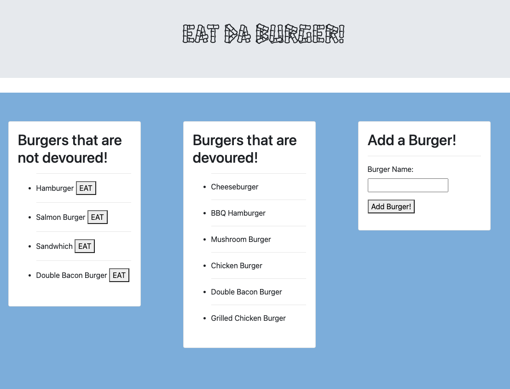

# eatDaBurgerApp

This is a burger logger app created using MySQL, Node, Express, Handlebars and ORM. This app lets the user input the names of the burgers they would like to eat. When the user submits the name of the burger, the app will display the burger on the left side of the page. When you click on the "eat" button next to the burger you want to eat, it will move that burger to the center column of the page. If you want to add another burger to the "Burgers that are not devoured!" column all you have to do is go to the "Add a Burger!" column and enter your desired burger on the space provided. 

Here is an image of the working app: 

GitHub Repo Link: https://github.com/Claudialhc/eatDaBurgerApp
 
Heroku Deployed Link:
  
My Portfolio Link: https://claudialhc.github.io/MyPortfolio/